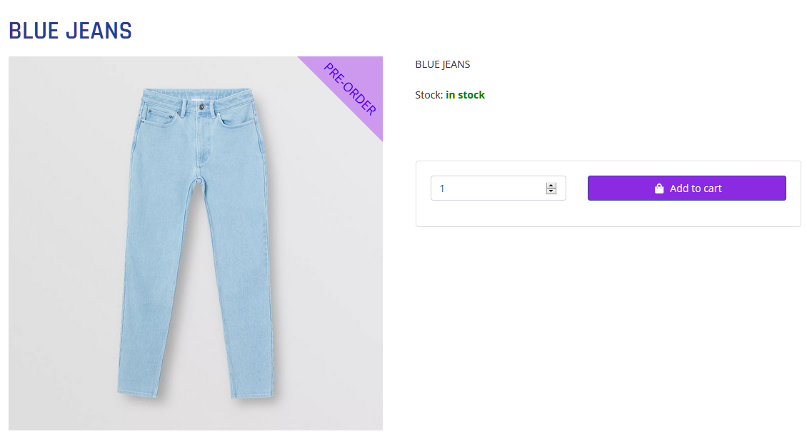
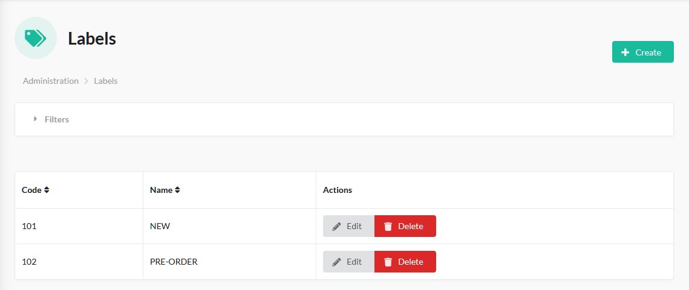
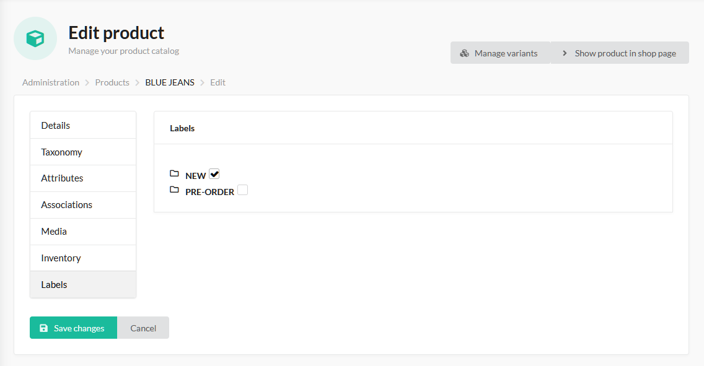

# Sylius Labels Plugin

[![Latest Version][ico-version]][link-packagist]
[![Latest Unstable Version][ico-unstable-version]][link-packagist]
[![Software License][ico-license]](LICENSE)
[![Build Status][ico-github-actions]][link-github-actions]

The labels plugin for [Sylius](https://sylius.com/) allows you to configure nice badges for different set of products
based on specific rules. It provides a common set of configuration by default and is very flexible when it comes to adding new ones.

Supports Doctrine ORM driver only.

## Screenshots

Shop:



Admin:





## Installation

### Step 1: Install the plugin

Open a command console, enter your project directory and execute the following command to download the latest stable version of this plugin:

```bash
$ composer require tavy315/sylius-labels-plugin
```

This command requires you to have Composer installed globally, as explained in the [installation chapter](https://getcomposer.org/doc/00-intro.md) of the Composer documentation.

### Step 2: Enable the plugin

Then, enable the plugin by adding it to the list of registered plugins/bundles
in `config/bundles.php` file of your project *before* (!) `SyliusGridBundle`:

```php
<?php
$bundles = [
    Tavy315\SyliusLabelsPlugin\Tavy315SyliusLabelsPlugin::class => ['all' => true],
    Sylius\Bundle\GridBundle\SyliusGridBundle::class => ['all' => true],
];
```

### Step 3: Configure plugin
```yaml
# config/packages/tavy315_product_labels.yaml

imports:
    - { resource: "@Tavy315SyliusLabelsPlugin/Resources/config/app/config.yaml" }
```

### Step 4: Import routing

```yaml
# config/routes/tavy315_product_labels.yaml

tavy315_product_labels:
    resource: "@Tavy315SyliusLabelsPlugin/Resources/config/routing.yaml"
```

### Step 5: Customize models

Read more about Sylius models customization [here](https://docs.sylius.com/en/latest/customization/model.html).

#### Customize your Product model

Add a `Tavy315\SyliusLabelsPlugin\Model\LabelsAwareTrait` trait to your `App\Entity\Product` class.

- If you use `annotations` mapping:

    ```php
    <?php 
    // src/Entity/Product.php
    
    namespace App\Entity;

    use Doctrine\ORM\Mapping as ORM;
    use Sylius\Component\Core\Model\Product as BaseProduct;
    use Tavy315\SyliusLabelsPlugin\Model\LabelsAwareTrait;
    use Tavy315\SyliusLabelsPlugin\Model\ProductInterface;
    
    /**
     * @ORM\Entity
     * @ORM\Table(name="sylius_product")
     */
    class Product extends BaseProduct implements ProductInterface
    {
        use LabelsAwareTrait {
            LabelsAwareTrait::__construct as private __labelsTraitConstruct;
        }
      
        public function __construct()
        {
            $this->__labelsTraitConstruct();
            parent::__construct();
        }
    }
    ```
    
- If you use `xml` mapping:

    ```php
    <?php
    // src/Model/Product.php
    
    namespace App\Model;
    
    use Sylius\Component\Core\Model\Product as BaseProduct;
    use Tavy315\SyliusLabelsPlugin\Model\LabelsAwareTrait;
    use Tavy315\SyliusLabelsPlugin\Model\ProductInterface;
    
    class Product extends BaseProduct implements ProductInterface
    {
        use LabelsAwareTrait {
            LabelsAwareTrait::__construct as private __labelsTraitConstruct;
        }
      
        public function __construct()
        {
            $this->__labelsTraitConstruct();
            parent::__construct();
        }
    }
    ```

    ```xml
    <?xml version="1.0" encoding="UTF-8"?>
    
    <doctrine-mapping xmlns="http://doctrine-project.org/schemas/orm/doctrine-mapping"
                      xmlns:xsi="http://www.w3.org/2001/XMLSchema-instance"
                      xsi:schemaLocation="http://doctrine-project.org/schemas/orm/doctrine-mapping
                                          http://doctrine-project.org/schemas/orm/doctrine-mapping.xsd">
    
        <entity name="App\Model\Product" table="sylius_product">
            <many-to-many field="labels" target-entity="Tavy315\SyliusLabelsPlugin\Model\LabelInterface">
                <join-table name="tavy315_sylius_product_labels">
                    <join-columns>
                        <join-column name="product_id" referenced-column-name="id" nullable="false" on-delete="CASCADE" />
                    </join-columns>
                    <inverse-join-columns>
                        <join-column name="label_id" referenced-column-name="id" nullable="false" on-delete="CASCADE" />
                    </inverse-join-columns>
                </join-table>
            </many-to-many>
        </entity>
    
    </doctrine-mapping>
    ```

If you haven't done so already, configure the `sylius_product` resource to point to your `App\Entity\Product` like we 
did in an example [here](tests/Application/config/packages/_sylius.yaml).

### Step 6: Update your database schema

```bash
$ php bin/console doctrine:migrations:diff
$ php bin/console doctrine:migrations:migrate
```
 
### Step 7: Add labels to your product templates 
Add labels to your product box template. By default, you should use `templates/bundles/SyliusShopBundle/Product/__mainImage.html.twig` 
path. Check out our [__mainImage.html.twig](tests/Application/templates/bundles/SyliusShopBundle/Product/__mainImage.html.twig) file for a reference.

Note the line: ``.


## Usage

From now on you should be able to add new labels in the admin panel. Once you add one, you can attach it to products.


[ico-version]: https://poser.pugx.org/tavy315/sylius-labels-plugin/v/stable
[ico-unstable-version]: https://poser.pugx.org/tavy315/sylius-labels-plugin/v/unstable
[ico-license]: https://poser.pugx.org/tavy315/sylius-labels-plugin/license
[ico-github-actions]: https://github.com/tavy315/SyliusLabelsPlugin/workflows/build/badge.svg
[ico-code-quality]: https://img.shields.io/scrutinizer/g/tavy315/SyliusLabelsPlugin.svg

[link-packagist]: https://packagist.org/packages/tavy315/sylius-labels-plugin
[link-github-actions]: https://github.com/tavy315/SyliusLabelsPlugin/actions
